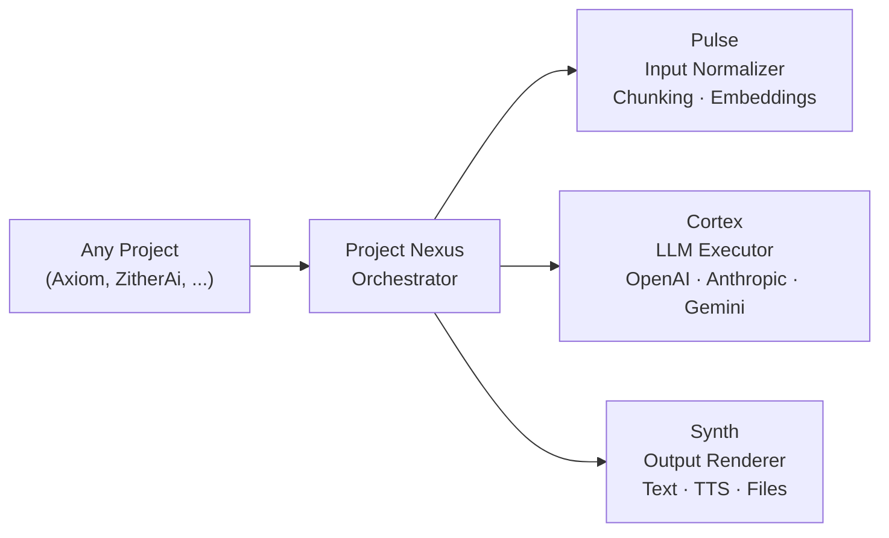
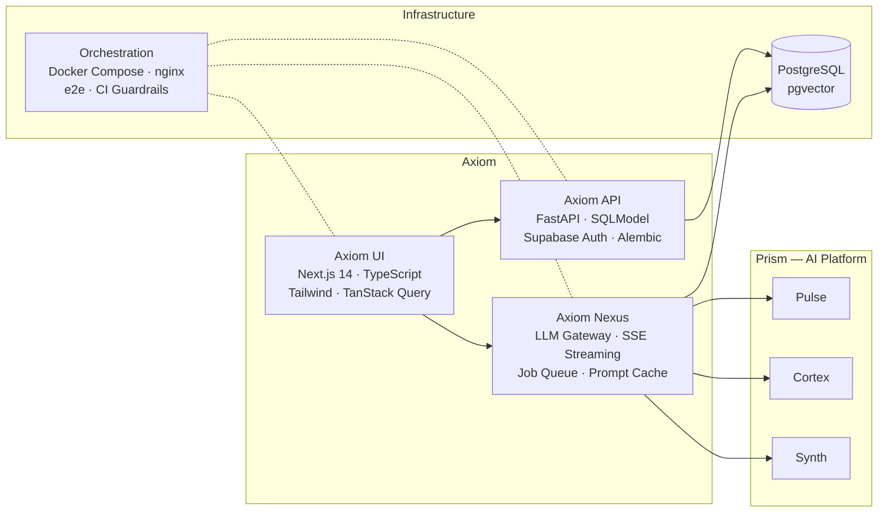
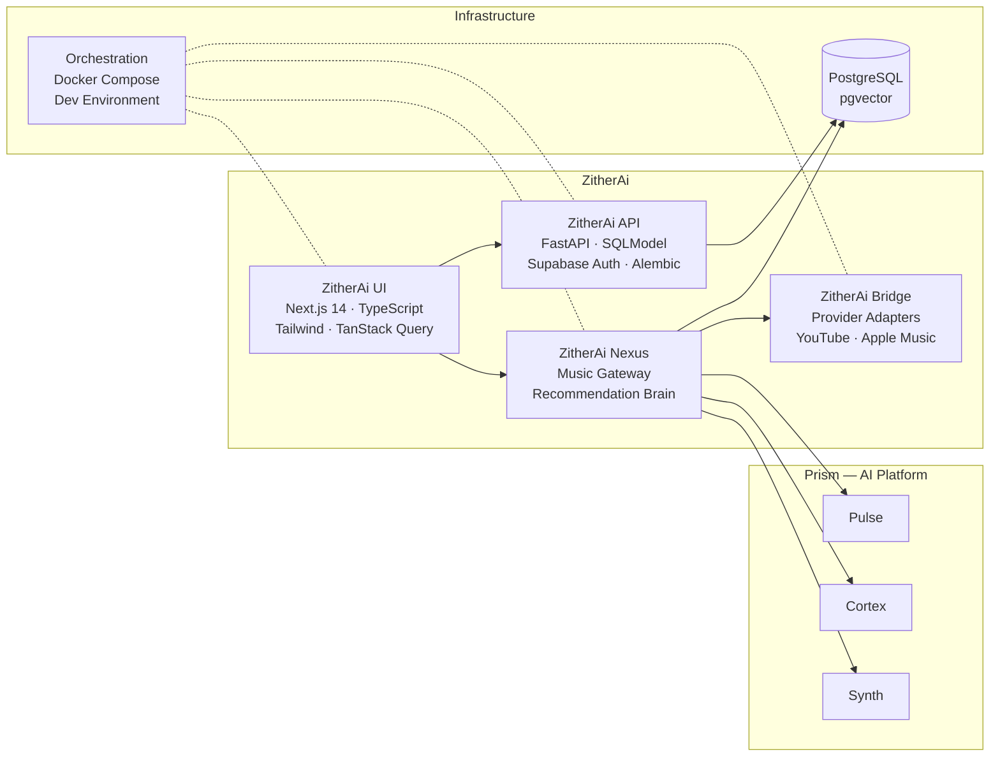

# Hi, I'm Vaibhav Singhal

Senior Software Engineer at Workday, focused on building scalable backend systems, clean APIs, and ambitious AI-driven products.

## About me

- Backend-focused engineer with a strong interest in system design and architecture
- Work primarily with Python (FastAPI, Flask, Django), Java (Micronaut), TypeScript (NestJS), PostgreSQL, AWS/GCP, and Docker
- Interested in LLM systems, developer tooling, and production-grade full-stack products

## Featured work

### Prism — Reusable AI microservices layer

Shared AI platform powering all AI-driven products below. Three stateless services — normalize input, execute LLM operations, render output. Provider-agnostic, bearer token auth, independently deployable.

| Repo | Stack | What it does |
|------|-------|-------------|
| [`pulse`](https://github.com/vsinghal3737/pulse) | FastAPI · stateless | Input normalizer — text chunking, embeddings, document parsing |
| [`cortex`](https://github.com/vsinghal3737/cortex) | FastAPI · stateless | LLM executor — multi-provider (OpenAI, Anthropic, Gemini), circuit breakers, fallback |
| [`synth`](https://github.com/vsinghal3737/synth) | FastAPI · stateless | Output renderer — text, TTS, file generation |

### Axiom — AI-powered markdown notes platform

Full-stack platform with 190+ PRs and 1,000+ tests. Domain-driven backend, streaming LLM gateway, and block-based editor — wired through Docker Compose with e2e testing and CI guardrails. Uses [Prism](#prism--reusable-ai-microservices-layer) for all AI operations.

| Repo | Stack | What it does |
|------|-------|-------------|
| [`Axiom-api`](https://github.com/vsinghal3737/Axiom-api) | FastAPI · SQLModel · PostgreSQL | Backend API — domain-driven layers, 300+ tests |
| [`Axiom-ui`](https://github.com/vsinghal3737/Axiom-ui) | Next.js 14 · TypeScript · Tailwind | Frontend — TanStack Query, Zustand, BlockNote editor |
| [`Axiom-nexus`](https://github.com/vsinghal3737/Axiom-nexus) | FastAPI · SSE · pgvector | LLM gateway — job orchestration, RAG, streaming, cost tracking |
| [`Axiom-orchestration`](https://github.com/vsinghal3737/Axiom-orchestration) | Docker Compose · nginx · Make | 7-service stack, e2e testing, policy guardrails |
| [`my-notes`](https://github.com/vsinghal3737/my-notes) | Monorepo | V1 (deprecated) — 59 PRs, migration reference |

### ZitherAi — AI music brain and playlist copilot

AI-powered music recommendation engine that sits on top of provider ecosystems (YouTube, Apple Music). Provider-agnostic AI taste layer for intent understanding, mood/vibe parsing, candidate retrieval, ranking, sequencing, and optional original music generation. Uses [Prism](#prism--reusable-ai-microservices-layer) for all AI operations.

| Repo | Stack | What it does |
|------|-------|-------------|
| [`ZitherAi-api`](https://github.com/vsinghal3737/ZitherAi-api) | FastAPI · SQLModel · PostgreSQL | Backend API — users, taste profiles, playlists |
| [`ZitherAi-ui`](https://github.com/vsinghal3737/ZitherAi-ui) | Next.js 14 · TypeScript · Tailwind | Frontend — conversational playlist generation |
| [`ZitherAi-nexus`](https://github.com/vsinghal3737/ZitherAi-nexus) | FastAPI · SSE · pgvector | Music gateway — recommendation brain, ranking, sequencing, taste embeddings |
| [`ZitherAi-bridge`](https://github.com/vsinghal3737/ZitherAi-bridge) | FastAPI · stateless | Provider adapters — YouTube and Apple Music integration |
| [`ZitherAi-orchestration`](https://github.com/vsinghal3737/ZitherAi-orchestration) | Docker Compose · Make | Multi-service stack, dev environment |

### Other projects

- **SmartKart** — AI-powered meal-kit ordering platform (event-driven, conversational ordering)
  - [`SmartKart-api`](https://github.com/vsinghal3737/SmartKart-api) — FastAPI · SQLModel · PostgreSQL · RabbitMQ
- **Portfolio** — [Repo](https://github.com/vsinghal3737/Vaibhav-Singhal-Portfolio) | [Live](https://www.vaibhavsinghal.dev/)
- **Monitoring Service**

---

*Building useful, scalable systems without unnecessary complexity.*
