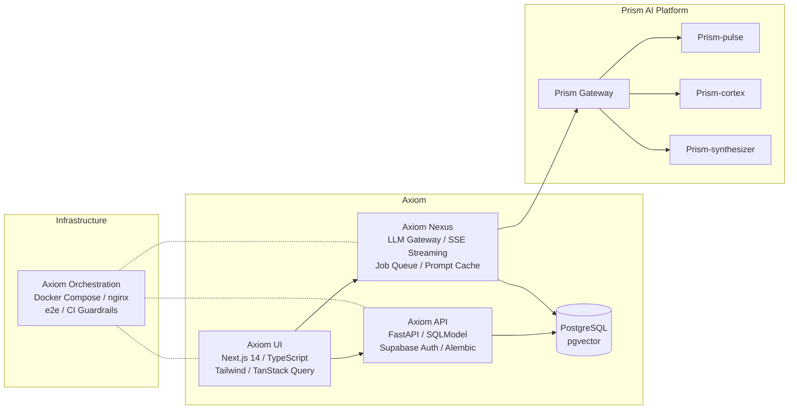
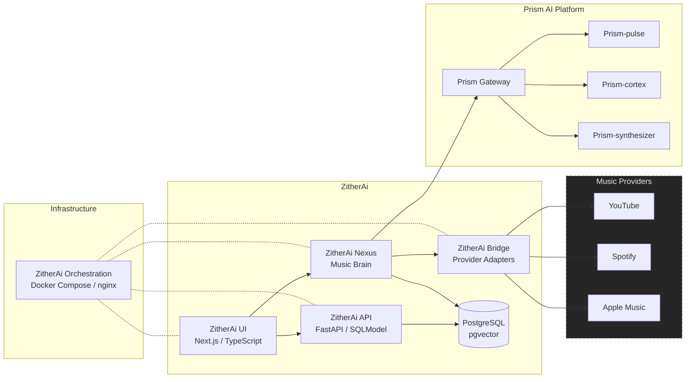

# Hi, I'm Vaibhav Singhal

Senior Software Engineer at Workday, focused on building scalable backend systems, clean APIs, and ambitious AI-driven products.

## About Me

- Backend-focused engineer with a strong interest in system design and architecture
- Work primarily with Python (FastAPI, Flask, Django), Java (Micronaut), TypeScript (NestJS), PostgreSQL, AWS/GCP, and Docker
- Interested in LLM systems, developer tooling, and production-grade full-stack products

## Featured Work

### Prism - Reusable AI Microservices Layer

Shared AI platform powering the products below. Prism exposes Pulse, Cortex, and Synthesizer behind one gateway, with stable routes like `/pulse/v1`, `/cortex/v1`, and `/synthesizer/v1`.

| Repo | Stack | What it does |
|------|-------|-------------|
| [`Prism-pulse`](https://github.com/vsinghal3737/Prism-pulse) | FastAPI / stateless | Input service: text normalization, document parsing, optional model-backed transforms |
| [`Prism-cortex`](https://github.com/vsinghal3737/Prism-cortex) | FastAPI / stateless | LLM executor: multi-provider OpenAI, Anthropic, Gemini, circuit breakers, fallback |
| [`Prism-synthesizer`](https://github.com/vsinghal3737/Prism-synthesizer) | FastAPI / stateless | Output service: text, TTS, file generation, optional model-backed composition |
| [`Prism-orchestration`](https://github.com/vsinghal3737/Prism-orchestration) | Docker Compose / nginx / Make | Independent Prism stack with gateway routing and external `prism-network` for consumer products |

### Axiom - AI-Powered Markdown Notes Platform

Full-stack markdown notes platform with a domain-driven FastAPI backend, Next.js editor, streaming LLM gateway, Docker orchestration, e2e tests, and CI guardrails.

| Repo | Stack | What it does |
|------|-------|-------------|
| [`Axiom-api`](https://github.com/vsinghal3737/Axiom-api) | FastAPI / SQLModel / PostgreSQL | Backend API: notes, workspaces, queue recovery |
| [`Axiom-ui`](https://github.com/vsinghal3737/Axiom-ui) | Next.js 14 / TypeScript / Tailwind | Frontend: TanStack Query, Zustand, BlockNote editor |
| [`Axiom-nexus`](https://github.com/vsinghal3737/Axiom-nexus) | FastAPI / SSE / pgvector | LLM gateway: jobs, RAG, streaming, cost tracking |
| [`Axiom-orchestration`](https://github.com/vsinghal3737/Axiom-orchestration) | Docker Compose / nginx / Make | Local stack, e2e testing, Prism network wiring |
| [`my-notes`](https://github.com/vsinghal3737/my-notes) | Monorepo | V1 migration reference |

### ZitherAi - AI Music Brain and Playlist Copilot

AI music brain and playlist copilot with provider adapters, taste modeling, playlist ranking, sequencing, and Prism-backed AI operations.

| Repo | Stack | What it does |
|------|-------|-------------|
| [`ZitherAi-api`](https://github.com/vsinghal3737/ZitherAi-api) | FastAPI / SQLModel / PostgreSQL | Backend API: users, taste profiles, playlists |
| [`ZitherAi-ui`](https://github.com/vsinghal3737/ZitherAi-ui) | Next.js 14 / TypeScript / Tailwind | Frontend: conversational playlist generation |
| [`ZitherAi-nexus`](https://github.com/vsinghal3737/ZitherAi-nexus) | FastAPI / SSE / pgvector | Music brain: recommendations, ranking, embeddings |
| [`ZitherAi-bridge`](https://github.com/vsinghal3737/ZitherAi-bridge) | FastAPI / stateless | Provider adapters: YouTube, Spotify, Apple Music |
| [`ZitherAi-orchestration`](https://github.com/vsinghal3737/ZitherAi-orchestration) | Docker Compose / nginx / Make | Local stack, gateway routing, Prism network wiring |

### Other Projects

- **SmartKart** - AI-powered meal-kit ordering platform with event-driven conversational ordering
  - [`SmartKart-api`](https://github.com/vsinghal3737/SmartKart-api) - FastAPI / SQLModel / PostgreSQL / RabbitMQ
- **Portfolio** - [Repo](https://github.com/vsinghal3737/Vaibhav-Singhal-Portfolio) | [Live](https://www.vaibhavsinghal.dev/)
- **Monitoring Service**

---

*Building useful, scalable systems without unnecessary complexity.*
