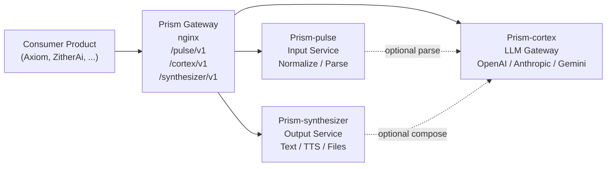
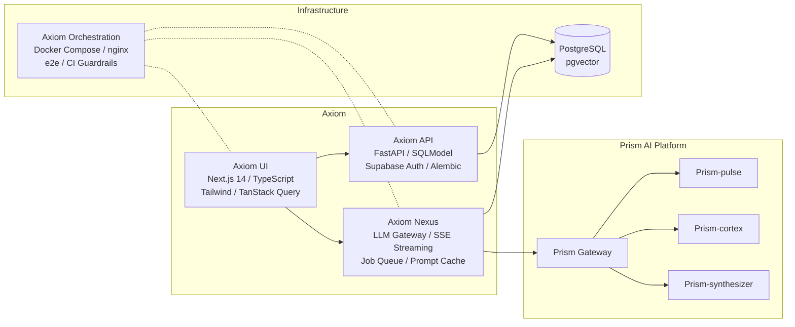
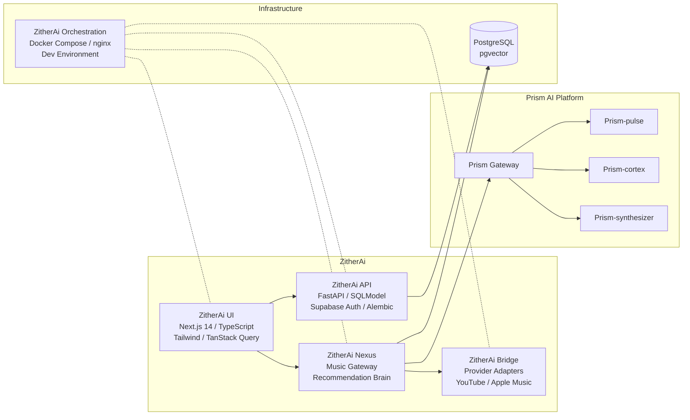

# Hi, I'm Vaibhav Singhal

Senior Software Engineer at Workday, focused on building scalable backend systems, clean APIs, and ambitious AI-driven products.

## About Me

- Backend-focused engineer with a strong interest in system design and architecture
- Work primarily with Python (FastAPI, Flask, Django), Java (Micronaut), TypeScript (NestJS), PostgreSQL, AWS/GCP, and Docker
- Interested in LLM systems, developer tooling, and production-grade full-stack products

## Featured Work

### Prism - Reusable AI Microservices Layer

Shared AI platform powering the AI-driven products below. Prism exposes Pulse, Cortex, and Synthesizer as stateless HTTP services behind a shared gateway, so consumer products call stable routes like `/pulse/v1`, `/cortex/v1`, and `/synthesizer/v1` instead of wiring directly to individual service containers. Prism orchestration lives in its own repo and creates the external `prism-network`.

| Repo | Stack | What it does |
|------|-------|-------------|
| [`Prism-pulse`](https://github.com/vsinghal3737/Prism-pulse) | FastAPI / stateless | Input service: text normalization, document parsing, optional model-backed transforms |
| [`Prism-cortex`](https://github.com/vsinghal3737/Prism-cortex) | FastAPI / stateless | LLM executor: multi-provider OpenAI, Anthropic, Gemini, circuit breakers, fallback |
| [`Prism-synthesizer`](https://github.com/vsinghal3737/Prism-synthesizer) | FastAPI / stateless | Output service: text, TTS, file generation, optional model-backed composition |
| [`Prism-orchestration`](https://github.com/vsinghal3737/Prism-orchestration) | Docker Compose / nginx / Make | Independent Prism stack with gateway routing and external `prism-network` for consumer products |

### Axiom - AI-Powered Markdown Notes Platform

Full-stack platform with 190+ PRs and 1,000+ tests. Domain-driven backend, streaming LLM gateway, and block-based editor, wired through its own Docker Compose stack with e2e testing and CI guardrails. Axiom reaches Prism through the Prism gateway on the external `prism-network`.

| Repo | Stack | What it does |
|------|-------|-------------|
| [`Axiom-api`](https://github.com/vsinghal3737/Axiom-api) | FastAPI / SQLModel / PostgreSQL | Backend API: domain-driven layers, queue recovery, 300+ tests |
| [`Axiom-ui`](https://github.com/vsinghal3737/Axiom-ui) | Next.js 14 / TypeScript / Tailwind | Frontend: TanStack Query, Zustand, BlockNote editor |
| [`Axiom-nexus`](https://github.com/vsinghal3737/Axiom-nexus) | FastAPI / SSE / pgvector | LLM gateway: job orchestration, RAG, streaming, cost tracking |
| [`Axiom-orchestration`](https://github.com/vsinghal3737/Axiom-orchestration) | Docker Compose / nginx / Make | Product orchestration: local stack, e2e testing, joins external `prism-network` |
| [`my-notes`](https://github.com/vsinghal3737/my-notes) | Monorepo | V1 deprecated migration reference |

### ZitherAi - AI Music Brain and Playlist Copilot

AI-powered music recommendation engine that sits on top of provider ecosystems like YouTube and Apple Music. Provider-agnostic AI taste layer for intent understanding, mood and vibe parsing, candidate retrieval, ranking, sequencing, and optional original music generation. ZitherAi reaches Prism through the Prism gateway on the external `prism-network`.

| Repo | Stack | What it does |
|------|-------|-------------|
| [`ZitherAi-api`](https://github.com/vsinghal3737/ZitherAi-api) | FastAPI / SQLModel / PostgreSQL | Backend API: users, taste profiles, playlists |
| [`ZitherAi-ui`](https://github.com/vsinghal3737/ZitherAi-ui) | Next.js 14 / TypeScript / Tailwind | Frontend: conversational playlist generation |
| [`ZitherAi-nexus`](https://github.com/vsinghal3737/ZitherAi-nexus) | FastAPI / SSE / pgvector | Music gateway: recommendation brain, ranking, sequencing, taste embeddings |
| [`ZitherAi-bridge`](https://github.com/vsinghal3737/ZitherAi-bridge) | FastAPI / stateless | Provider adapters: YouTube and Apple Music integration |
| [`ZitherAi-orchestration`](https://github.com/vsinghal3737/ZitherAi-orchestration) | Docker Compose / nginx / Make | Product orchestration: local stack, gateway routing, joins external `prism-network` |

### Other Projects

- **SmartKart** - AI-powered meal-kit ordering platform with event-driven conversational ordering
  - [`SmartKart-api`](https://github.com/vsinghal3737/SmartKart-api) - FastAPI / SQLModel / PostgreSQL / RabbitMQ
- **Portfolio** - [Repo](https://github.com/vsinghal3737/Vaibhav-Singhal-Portfolio) | [Live](https://www.vaibhavsinghal.dev/)
- **Monitoring Service**

---

*Building useful, scalable systems without unnecessary complexity.*
