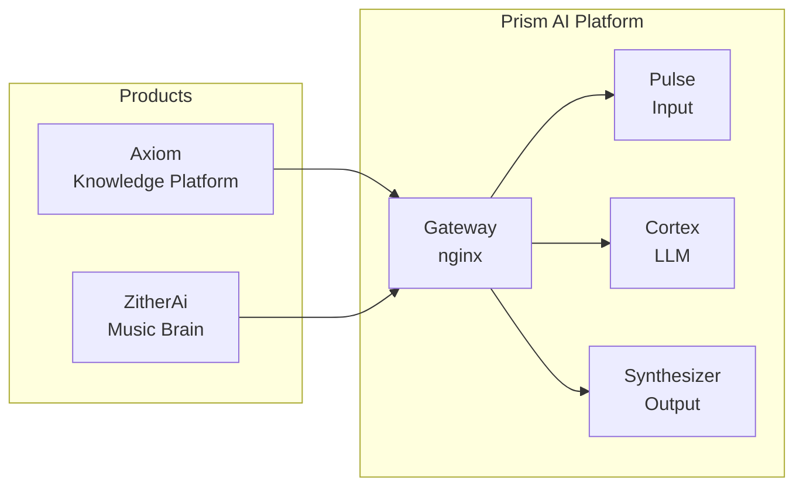
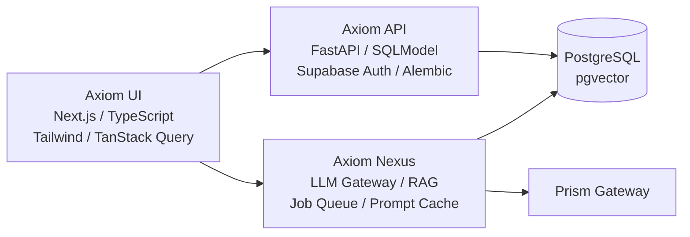
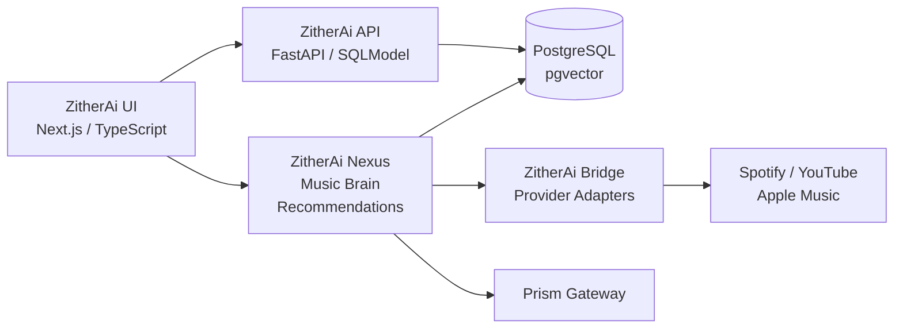
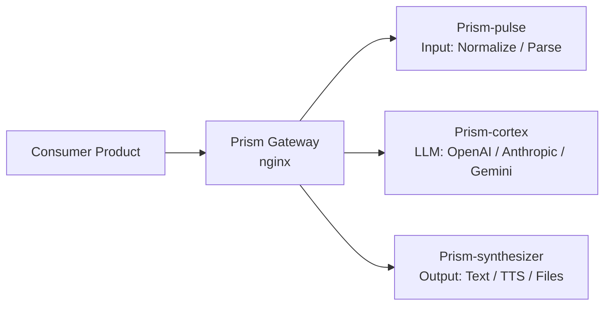

# Hey, I'm Vaibhav

Senior Software Engineer at Workday. I design and build production-grade distributed systems, AI-powered products, and developer infrastructure — then open-source the interesting parts.

---

### What I Build

**[Axiom](https://github.com/vsinghal3737?tab=repositories&q=axiom)** — AI-powered markdown knowledge platform with streaming LLM workflows, semantic graph, RAG, and a rich editor. Graph View, Canvas, Tables, Review Inbox, Knowledge Q&A, Smart Paste, Weekly Reports, Daily Sparks.

**[ZitherAi](https://github.com/vsinghal3737?tab=repositories&q=zitherai)** — Music intelligence product with taste modeling, playlist synthesis, explainable recommendations, duplicate analysis, and provider adapters for Spotify, YouTube, and Apple Music.

**[Prism](https://github.com/vsinghal3737?tab=repositories&q=prism)** — Shared AI microservices layer powering both products. Three stateless services (Pulse, Cortex, Synthesizer) behind an nginx gateway with multi-provider LLM support, circuit breakers, and fallback chains.

---

### Tech Stack

---

### Architecture

All three products share Prism as the AI backbone. Each product has its own API, UI, Nexus (AI brain), and orchestration layer.

```mermaid
flowchart LR
    subgraph Products
        Axiom["Axiom<br/>Knowledge Platform"]
        ZitherAi["ZitherAi<br/>Music Brain"]
    end

    subgraph Prism["Prism AI Platform"]
        GW["Gateway<br/>nginx"]
        P["Pulse<br/>Input"]
        C["Cortex<br/>LLM"]
        S["Synthesizer<br/>Output"]
    end

    Axiom --> GW
    ZitherAi --> GW
    GW --> P & C & S
```

<strong>Axiom — detailed architecture</strong>

 

Full-stack markdown notes platform with domain-driven FastAPI backend, Next.js editor, streaming and queued AI workflows, Docker orchestration, e2e tests, and CI guardrails.

```mermaid
flowchart LR
    UI["Axiom UI<br/>Next.js / TypeScript<br/>Tailwind / TanStack Query"]
    API["Axiom API<br/>FastAPI / SQLModel<br/>Supabase Auth / Alembic"]
    Nexus["Axiom Nexus<br/>LLM Gateway / RAG<br/>Job Queue / Prompt Cache"]
    PG[("PostgreSQL<br/>pgvector")]
    Gateway["Prism Gateway"]

    UI --> API
    UI --> Nexus
    Nexus --> Gateway
    API --> PG
    Nexus --> PG
```

| Repo | Stack | What it does |
|------|-------|-------------|
| [`Axiom-api`](https://github.com/vsinghal3737/Axiom-api) | FastAPI / SQLModel / PostgreSQL | Backend API: notes, workspaces, graph/canvas/review, semantic search, AI proxies |
| [`Axiom-ui`](https://github.com/vsinghal3737/Axiom-ui) | Next.js / TypeScript / Tailwind | Frontend: BlockNote editor, graph/canvas/table surfaces, Review Inbox, AI reasoning UI |
| [`Axiom-nexus`](https://github.com/vsinghal3737/Axiom-nexus) | FastAPI / SSE / pgvector | AI gateway: jobs, RAG, embeddings, prompt cache, reasoning, similarity |
| [`Axiom-orchestration`](https://github.com/vsinghal3737/Axiom-orchestration) | Docker Compose / nginx / Make | Local stack, gateway routing, e2e testing, Prism network wiring |

<strong>ZitherAi — detailed architecture</strong>

 

AI music brain and playlist copilot with provider adapters, taste modeling, playlist synthesis, smart discovery, explainable recommendations, and library hygiene workflows.

```mermaid
flowchart LR
    ZUI["ZitherAi UI<br/>Next.js / TypeScript"]
    ZAPI["ZitherAi API<br/>FastAPI / SQLModel"]
    ZNexus["ZitherAi Nexus<br/>Music Brain<br/>Recommendations"]
    ZBridge["ZitherAi Bridge<br/>Provider Adapters"]
    PG[("PostgreSQL<br/>pgvector")]
    Providers["Spotify / YouTube<br/>Apple Music"]
    Gateway["Prism Gateway"]

    ZUI --> ZAPI
    ZUI --> ZNexus
    ZAPI --> PG
    ZNexus --> PG
    ZNexus --> ZBridge
    ZBridge --> Providers
    ZNexus --> Gateway
```

| Repo | Stack | What it does |
|------|-------|-------------|
| [`ZitherAi-api`](https://github.com/vsinghal3737/ZitherAi-api) | FastAPI / SQLModel / PostgreSQL | Backend API: users, provider accounts, taste memory, playlists, library and history |
| [`ZitherAi-ui`](https://github.com/vsinghal3737/ZitherAi-ui) | Next.js / TypeScript / Tailwind | Frontend: discovery, playlists, prompt library, history, saved views, duplicate clusters |
| [`ZitherAi-nexus`](https://github.com/vsinghal3737/ZitherAi-nexus) | FastAPI / SSE / pgvector | Music brain: recommendations, synthesis, briefings, duplicate analysis, embeddings |
| [`ZitherAi-bridge`](https://github.com/vsinghal3737/ZitherAi-bridge) | FastAPI / stateless | Provider adapters: YouTube, Spotify, Apple Music, paginated imports |
| [`ZitherAi-orchestration`](https://github.com/vsinghal3737/ZitherAi-orchestration) | Docker Compose / nginx / Make | Local stack, gateway routing, Prism network wiring, e2e checks |

<strong>Prism — detailed architecture</strong>

 

Reusable AI microservices layer. Stateless services behind an nginx gateway with stable routes (`/pulse/v1`, `/cortex/v1`, `/synthesizer/v1`).

```mermaid
flowchart LR
    Client["Consumer Product"]
    Gateway["Prism Gateway<br/>nginx"]
    Pulse["Prism-pulse<br/>Input: Normalize / Parse"]
    Cortex["Prism-cortex<br/>LLM: OpenAI / Anthropic / Gemini"]
    Synthesizer["Prism-synthesizer<br/>Output: Text / TTS / Files"]

    Client --> Gateway
    Gateway --> Pulse
    Gateway --> Cortex
    Gateway --> Synthesizer
```

| Repo | Stack | What it does |
|------|-------|-------------|
| [`Prism-pulse`](https://github.com/vsinghal3737/Prism-pulse) | FastAPI / stateless | Input service: text normalization, document parsing, model-backed transforms |
| [`Prism-cortex`](https://github.com/vsinghal3737/Prism-cortex) | FastAPI / stateless | LLM executor: multi-provider, circuit breakers, fallback chains |
| [`Prism-synthesizer`](https://github.com/vsinghal3737/Prism-synthesizer) | FastAPI / stateless | Output service: text, TTS, file generation |
| [`Prism-orchestration`](https://github.com/vsinghal3737/Prism-orchestration) | Docker Compose / nginx / Make | Gateway routing, dev/e2e env, external `prism-network` |

---

### Other Projects

- **SmartKart** — AI-powered meal-kit ordering with event-driven conversational ordering — [`SmartKart-api`](https://github.com/vsinghal3737/SmartKart-api)
- **Portfolio** — [vaibhavsinghal.dev](https://www.vaibhavsinghal.dev/) — [`repo`](https://github.com/vsinghal3737/Vaibhav-Singhal-Portfolio)

