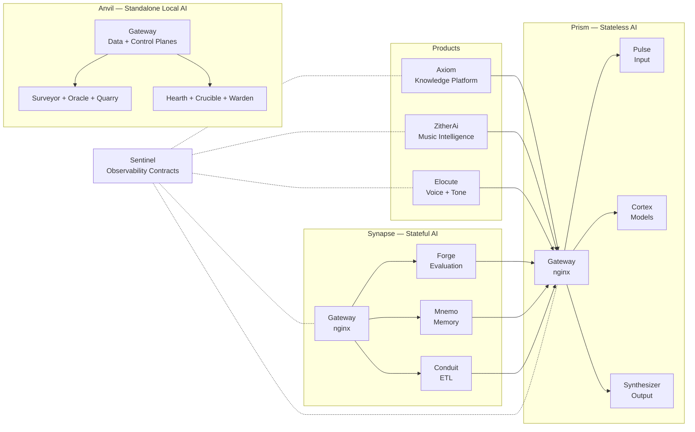
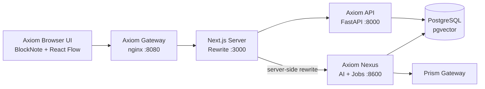
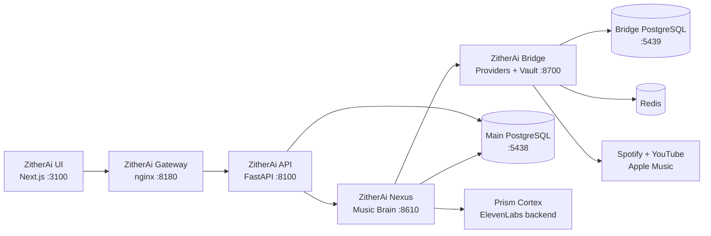
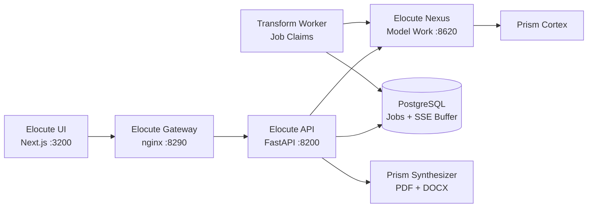
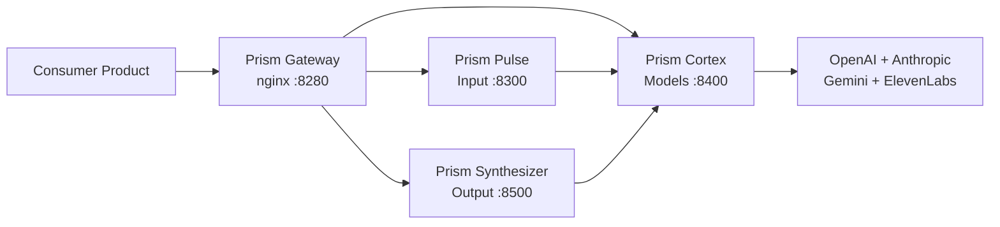
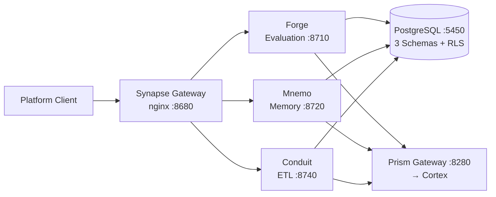
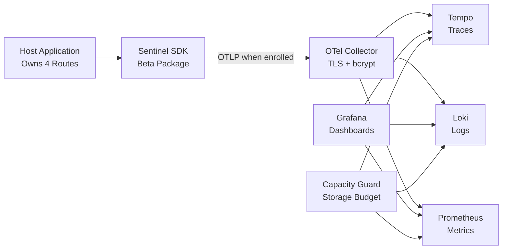
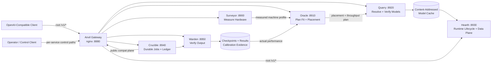

# Hey, I'm Vaibhav

Senior Software Engineer at Workday. I design and build distributed systems, AI-powered products, and developer infrastructure — then open-source the interesting parts.

---

### What I Build

**[Axiom](https://github.com/vsinghal3737?tab=repositories&q=axiom)** — AI-powered markdown knowledge platform built around a BlockNote editor, Dream Query across an entire workspace, Assist against one note, and React Flow surfaces for Graph View and Canvas. Durable chat runs replay over SSE by `Last-Event-ID`; spend accounting and per-project budgets, an AST-enforced per-note Vault, change sets, voice notes, dictation, TTS, writing-style adaptation, queue visibility, versions, trash, and export round out the workflow. Its hardening includes RFC 9457 errors, circuit breakers, RED metrics, architecture contract tests, and a transactional outbox. 2,939 tests across 5 repos.

**[ZitherAi](https://github.com/vsinghal3737?tab=repositories&q=zitherai)** — Music intelligence product for taste modeling, four-stage natural-language curation, playlist synthesis, CRDT sync, photo soundtracks, library hygiene, and provider migration through exact ISRC, normalized, fuzzy, LLM, and user matching. Keyword, semantic, and auto search share one router while hum and clip search use a dedicated audio endpoint. It adds HDBSCAN genre clustering, NL-to-SQL listening analytics, and music generation through Prism Cortex with an ElevenLabs backend. 1,705 tests across 6 repos.

**[Elocute](https://github.com/vsinghal3737?tab=repositories&q=elocute)** — Voice-to-text and tone transformation product with recording, transcription, four-stage smart processing, 17 tone presets, TTS, templates, analytics, compose flows, and export to PDF, DOCX, MD, SRT, and TXT. Transform work is job-backed: the API returns `202` with a stream URL, a worker claims work with `FOR UPDATE SKIP LOCKED`, and SSE replays from a PostgreSQL-backed buffer. 326 tests across 5 repos.

**[Prism](https://github.com/vsinghal3737?tab=repositories&q=prism)** — Shared stateless AI platform: 31 endpoints across Pulse, Cortex, and Synthesizer behind an nginx gateway. OpenAI, Anthropic, Gemini, and ElevenLabs sit behind per-modality circuit breakers, provider bulkheads, fallback chains, idempotency replay, project-scoped rate limiting, SSRF and media hardening, and per-route body ceilings. Prism owns zero databases, tables, or migrations; callers own durability. 1,072 tests across 5 repos.

**[Synapse](https://github.com/vsinghal3737?tab=repositories&q=synapse)** — Shared stateful AI platform: Forge for evaluation, Mnemo for hierarchical memory, and Conduit for ETL, with 68 endpoints, 18 tables across 3 schemas, and 30 migrations. Tenant isolation lives in PostgreSQL through 69 row-level security policies and a two-login ownership model; transaction-local context, startup privilege checks, and byte-identical `404` responses close common bypasses. Synapse holds no provider credentials — model work goes through Prism Cortex. 614 tests across 5 repos.

**[Sentinel](https://github.com/vsinghal3737?tab=repositories&q=sentinel)** — Observability platform with a beta SDK and a six-container telemetry stack. `instrument(app, "service-name")` enables FastAPI and HTTPX instrumentation by default, adds Redis and SQLAlchemy only when named, and contributes four host-owned route contracts without opening a listener. OTLP ingress uses TLS and per-consumer bcrypt credentials. The platform is implemented and tested; consumer rollout remains pending. 335 tests across 3 repos.

**[Anvil](https://github.com/vsinghal3737?tab=repositories&q=anvil)** — Standalone hardware-aware local-LLM platform. It measures real machine capability, predicts model fit and throughput before download, selects an appropriate inference engine, and adds durable, verified execution for long unattended batch jobs. Its OpenAI-compatible data plane makes adoption a `base_url` swap; its control plane handles hardware discovery, planning, model supply, runtime lifecycle, checkpointed work, and output validation across 8 repos.

Together: approximately 7,000 tests across 37 repositories.

---

### Tech Stack

---

### Architecture

The portfolio contains three products and two shared AI platforms: **Prism** for stateless processing and **Synapse** for stateful evaluation, memory, and ETL. **Sentinel** defines the observability platform and enrollment contracts. **Anvil** is deliberately standalone. No product-to-Synapse integration is deployed.

```mermaid
flowchart LR
    subgraph Products["Products"]
        Axiom["Axiom<br/>Knowledge Platform"]
        ZitherAi["ZitherAi<br/>Music Intelligence"]
        Elocute["Elocute<br/>Voice + Tone"]
    end

    subgraph Prism["Prism — Stateless AI"]
        PGW["Gateway<br/>nginx"]
        P["Pulse<br/>Input"]
        C["Cortex<br/>Models"]
        S["Synthesizer<br/>Output"]
    end

    subgraph Synapse["Synapse — Stateful AI"]
        SGW["Gateway<br/>nginx"]
        F["Forge<br/>Evaluation"]
        M["Mnemo<br/>Memory"]
        D["Conduit<br/>ETL"]
    end

    subgraph Anvil["Anvil — Standalone Local AI"]
        AGW["Gateway<br/>Data + Control Planes"]
        AS["Surveyor + Oracle + Quarry"]
        AR["Hearth + Crucible + Warden"]
        AGW --> AS
        AGW --> AR
    end

    Sentinel["Sentinel<br/>Observability Contracts"]

    Axiom --> PGW
    ZitherAi --> PGW
    Elocute --> PGW
    F --> PGW
    M --> PGW
    D --> PGW

    PGW --> P
    PGW --> C
    PGW --> S
    SGW --> F
    SGW --> M
    SGW --> D

    Sentinel -.- Axiom
    Sentinel -.- ZitherAi
    Sentinel -.- Elocute
    Sentinel -.- PGW
    Sentinel -.- SGW
```

*Dotted edges are defined contracts, not deployed paths — the Sentinel SDK is built and tested; consumer rollout is pending.*

<strong>Axiom — detailed architecture</strong>

 

A markdown knowledge platform with a Next.js workspace, a domain-driven FastAPI API, a server-side Nexus rewrite, PostgreSQL and pgvector storage, and Prism-backed AI. The browser never calls Nexus directly. Durable chat jobs replay over SSE by `Last-Event-ID`; the former direct-streaming endpoint is `410 Gone`.

```mermaid
flowchart LR
    UI["Axiom Browser UI<br/>BlockNote + React Flow"]
    Next["Next.js Server<br/>Rewrite :3000"]
    API["Axiom API<br/>FastAPI :8000"]
    Nexus["Axiom Nexus<br/>AI + Jobs :8600"]
    PG[("PostgreSQL<br/>pgvector")]
    Gateway["Prism Gateway"]
    Edge["Axiom Gateway<br/>nginx :8080"]

    UI --> Edge
    Edge --> Next
    Next --> API
    Next -->|"server-side rewrite"| Nexus
    API --> PG
    Nexus --> PG
    Nexus --> Gateway
```

| Repo | Stack | What it does | Tests |
|---|---|---|---:|
| [`Axiom-api`](https://github.com/vsinghal3737/Axiom-api) | FastAPI / SQLModel / PostgreSQL | Notes, workspaces, semantic graph, Vault, change sets, durable chat orchestration, spend budgets, and transactional outbox | 1,248 |
| [`Axiom-nexus`](https://github.com/vsinghal3737/Axiom-nexus) | FastAPI / SSE / pgvector | AI jobs, RAG, embeddings, prompt cache, Dream Query, Assist, reasoning, and similarity | 559 |
| [`Axiom-ui`](https://github.com/vsinghal3737/Axiom-ui) | Next.js / TypeScript / Tailwind | BlockNote editor, Graph View, Canvas, Review Inbox, voice and dictation, queue dashboard, versions, trash, and export | 957 |
| [`Axiom-orchestration`](https://github.com/vsinghal3737/Axiom-orchestration) | Docker Compose / nginx / Make | Gateway on `8080`, stack wiring, health checks, and end-to-end verification | 175 |
| [`Axiom-atlas`](https://github.com/vsinghal3737/Axiom-atlas) | Documentation / ADRs | Cross-repo architecture, contracts, capabilities, and family decisions | — |

<strong>ZitherAi — detailed architecture</strong>

 

A music intelligence system spanning provider adapters, taste modeling, natural-language curation, migration, CRDT sync, audio search, analytics, and generation. Bridge is stateful: it owns PostgreSQL on `5439`, Redis, and an AES-256-GCM token vault with a versioned KEK ring. The main product database runs on `5438`.

```mermaid
flowchart LR
    ZUI["ZitherAi UI<br/>Next.js :3100"]
    ZGW["ZitherAi Gateway<br/>nginx :8180"]
    ZAPI["ZitherAi API<br/>FastAPI :8100"]
    ZNexus["ZitherAi Nexus<br/>Music Brain :8610"]
    ZBridge["ZitherAi Bridge<br/>Providers + Vault :8700"]
    MainDB[("Main PostgreSQL<br/>:5438")]
    BridgeDB[("Bridge PostgreSQL<br/>:5439")]
    Redis[("Redis")]
    Providers["Spotify + YouTube<br/>Apple Music"]
    Prism["Prism Cortex<br/>ElevenLabs backend"]

    ZUI --> ZGW
    ZGW --> ZAPI
    ZAPI --> ZNexus
    ZAPI --> MainDB
    ZNexus --> MainDB
    ZNexus --> ZBridge
    ZNexus --> Prism
    ZBridge --> BridgeDB
    ZBridge --> Redis
    ZBridge --> Providers
```

| Repo | Stack | What it does | Tests |
|---|---|---|---:|
| [`ZitherAi-api`](https://github.com/vsinghal3737/ZitherAi-api) | FastAPI / SQLModel / PostgreSQL | Users, providers, taste profiles, playlists, library, listening history, and HMAC-authenticated service flows | 362 |
| [`ZitherAi-nexus`](https://github.com/vsinghal3737/ZitherAi-nexus) | FastAPI / SSE / pgvector | Curation, CRDT sync, generation jobs, keyword/semantic/auto and audio search, clustering, analytics, and cost ledger | 656 |
| [`ZitherAi-bridge`](https://github.com/vsinghal3737/ZitherAi-bridge) | FastAPI / PostgreSQL / Redis | Spotify, YouTube, and Apple Music adapters plus the AES-256-GCM vault, rate limits, and circuit breakers | 233 |
| [`ZitherAi-ui`](https://github.com/vsinghal3737/ZitherAi-ui) | Next.js / TypeScript / Tailwind | Discovery, curation, migration, generation, audio search, library graph, and player experiences | 388 |
| [`ZitherAi-orchestration`](https://github.com/vsinghal3737/ZitherAi-orchestration) | Docker Compose / nginx / Make | Gateway, product stack, database, Prism wiring, health checks, and end-to-end verification | 47 |
| [`ZitherAi-atlas`](https://github.com/vsinghal3737/ZitherAi-atlas) | Documentation / ADRs | Cross-repo architecture, contracts, capabilities, and family decisions | — |

<strong>Elocute — detailed architecture</strong>

 

A voice-to-text and tone system with four smart-processing stages — filler removal, backtrack correction, punctuation, and formatting — plus 17 tone presets and five export formats. The API has two upstreams: Nexus for model work and Prism Synthesizer directly for PDF and DOCX rendering. Transform jobs return `202` and a stream URL; workers poll with `FOR UPDATE SKIP LOCKED`, while SSE reads from a PostgreSQL-backed buffer.

```mermaid
flowchart LR
    EUI["Elocute UI<br/>Next.js :3200"]
    EGW["Elocute Gateway<br/>nginx :8290"]
    EAPI["Elocute API<br/>FastAPI :8200"]
    ENexus["Elocute Nexus<br/>Model Work :8620"]
    Worker["Transform Worker<br/>Job Claims"]
    PG[("PostgreSQL<br/>Jobs + SSE Buffer")]
    Cortex["Prism Cortex"]
    Synth["Prism Synthesizer<br/>PDF + DOCX"]

    EUI --> EGW
    EGW --> EAPI
    EAPI --> ENexus
    EAPI --> Synth
    EAPI --> PG
    ENexus --> Cortex
    Worker --> PG
    Worker --> ENexus
```

| Repo | Stack | What it does | Tests |
|---|---|---|---:|
| [`Elocute-api`](https://github.com/vsinghal3737/Elocute-api) | FastAPI / SQLModel / PostgreSQL | Sessions, history, jobs, SSE replay, dictionary, snippets, templates, analytics, and file export | 88 |
| [`Elocute-nexus`](https://github.com/vsinghal3737/Elocute-nexus) | FastAPI / SSE / Redis | Transcription, four-stage processing, tone transforms, TTS, and compose generation | 93 |
| [`Elocute-ui`](https://github.com/vsinghal3737/Elocute-ui) | Next.js / TypeScript / Tailwind | Recorder, tone controls, transform streaming, exports, templates, compose, and analytics | 125 |
| [`Elocute-orchestration`](https://github.com/vsinghal3737/Elocute-orchestration) | Docker Compose / nginx / Make | Gateway, product stack, Prism wiring, health checks, and end-to-end verification | 20 |
| [`Elocute-atlas`](https://github.com/vsinghal3737/Elocute-atlas) | Documentation / ADRs | Cross-repo architecture, contracts, capabilities, and family decisions | — |

<strong>Prism — detailed architecture</strong>

 

A reusable stateless AI platform with 31 endpoints and no databases, tables, or migrations. Consumers enter only through the gateway. Pulse and Synthesizer call Cortex directly across the internal network to avoid proxy loops. Cortex supports OpenAI, Anthropic, Gemini, and ElevenLabs; ElevenLabs supplies TTS and music generation.

```mermaid
flowchart LR
    Client["Consumer Product"]
    Gateway["Prism Gateway<br/>nginx :8280"]
    Pulse["Prism Pulse<br/>Input :8300"]
    Cortex["Prism Cortex<br/>Models :8400"]
    Synth["Prism Synthesizer<br/>Output :8500"]
    Providers["OpenAI + Anthropic<br/>Gemini + ElevenLabs"]

    Client --> Gateway
    Gateway --> Pulse
    Gateway --> Cortex
    Gateway --> Synth
    Pulse --> Cortex
    Synth --> Cortex
    Cortex --> Providers
```

| Repo | Stack | What it does | Tests |
|---|---|---|---:|
| [`Prism-pulse`](https://github.com/vsinghal3737/Prism-pulse) | FastAPI / stateless | Text normalization, document parsing, audio preparation, SSRF defenses, and route-specific body limits | 282 |
| [`Prism-cortex`](https://github.com/vsinghal3737/Prism-cortex) | FastAPI / stateless | Multi-provider model execution, bulkheads, circuit breakers, fallback chains, idempotency replay, and rate limiting | 381 |
| [`Prism-synthesizer`](https://github.com/vsinghal3737/Prism-synthesizer) | FastAPI / stateless | Text and file rendering, TTS, music generation, media hardening, and output controls | 285 |
| [`Prism-orchestration`](https://github.com/vsinghal3737/Prism-orchestration) | Docker Compose / nginx / Make | Gateway, external network, health checks, and end-to-end verification | 124 |
| [`Prism-atlas`](https://github.com/vsinghal3737/Prism-atlas) | Documentation / ADRs | Prism family truth and the canonical architecture map across all seven families | — |

<strong>Synapse — detailed architecture</strong>

 

A stateful AI platform with 68 endpoints, 18 tables in three schemas, and 30 migrations. Its 69 PostgreSQL row-level security policies use a two-login model: a migration login owns tables, while constrained runtime logins own nothing. Tenant context is transaction-local and reapplied on every begin; startup refuses superuser, `BYPASSRLS`, or table-owning connections. Out-of-scope and unknown projects return byte-identical `404` responses. All model work goes through Prism Cortex, so Synapse stores no provider credentials.

```mermaid
flowchart LR
    Client["Platform Client"]
    Gateway["Synapse Gateway<br/>nginx :8680"]
    Forge["Forge<br/>Evaluation :8710"]
    Mnemo["Mnemo<br/>Memory :8720"]
    Conduit["Conduit<br/>ETL :8740"]
    PG[("PostgreSQL :5450<br/>3 Schemas + RLS")]
    Prism["Prism Gateway :8280<br/>→ Cortex"]

    Client --> Gateway
    Gateway --> Forge
    Gateway --> Mnemo
    Gateway --> Conduit
    Forge --> PG
    Mnemo --> PG
    Conduit --> PG
    Forge --> Prism
    Mnemo --> Prism
    Conduit --> Prism
```

Forge runs Mann-Whitney U and bootstrap confidence intervals for regression detection across 11 assertion types. Mnemo models half-lives of 2 hours for working memory, 30 days episodic, 180 days semantic, and 10 years procedural; recall reinforces memory, 3 or more episodes promote to semantic, 5 or more accesses promote to procedural, and stale memory prunes at 90 days. Conduit adds per-chunk checkpoints, bounded retry, a dead-letter queue, and adaptive outbound backpressure.

| Repo | Stack | What it does | Tests |
|---|---|---|---:|
| [`Synapse-forge`](https://github.com/vsinghal3737/Synapse-forge) | FastAPI / PostgreSQL | Prompt versions, 11 assertion types, LLM-as-Judge evaluation, and statistical regression detection | 144 |
| [`Synapse-mnemo`](https://github.com/vsinghal3737/Synapse-mnemo) | FastAPI / PostgreSQL / pgvector | Extraction, hierarchical memory, forgetting curves, reinforcement, promotion, pruning, and hybrid retrieval | 162 |
| [`Synapse-conduit`](https://github.com/vsinghal3737/Synapse-conduit) | FastAPI / PostgreSQL | Checkpointed ETL, extraction, bounded retries, dead-letter handling, and adaptive backpressure | 167 |
| [`Synapse-orchestration`](https://github.com/vsinghal3737/Synapse-orchestration) | Docker Compose / nginx / Make | Gateway, shared PostgreSQL, schema migrations, runtime-role wiring, and end-to-end checks | 141 |
| [`Synapse-atlas`](https://github.com/vsinghal3737/Synapse-atlas) | Documentation / ADRs | Cross-repo architecture, contracts, capabilities, and family decisions | — |

<strong>Sentinel — detailed architecture</strong>

 

An observability platform whose beta SDK exports `instrument(app, "service-name")` from the package root. FastAPI and HTTPX instrument by default; Redis and SQLAlchemy instrument only when named. The SDK opens no listener and instead contributes four route contracts owned by the host application. OTLP ingress is protected with TLS and per-consumer bcrypt credentials. The six-container stack adds a capacity guard that watches the storage budget alongside the collector and telemetry backends.

```mermaid
flowchart LR
    App["Host Application<br/>Owns 4 Routes"]
    SDK["Sentinel SDK<br/>Beta Package"]
    Collector["OTel Collector<br/>TLS + bcrypt"]
    Tempo["Tempo<br/>Traces"]
    Loki["Loki<br/>Logs"]
    Prom["Prometheus<br/>Metrics"]
    Grafana["Grafana<br/>Dashboards"]
    Guard["Capacity Guard<br/>Storage Budget"]

    App --> SDK
    SDK -. "OTLP when enrolled" .-> Collector
    Collector --> Tempo
    Collector --> Loki
    Collector --> Prom
    Grafana --> Tempo
    Grafana --> Loki
    Grafana --> Prom
    Guard --> Tempo
    Guard --> Loki
    Guard --> Prom
```

| Repo | Stack | What it does | Tests |
|---|---|---|---:|
| [`Sentinel-sdk`](https://github.com/vsinghal3737/Sentinel-sdk) | Python / OpenTelemetry / structlog | Host instrumentation, structured logs, metrics, traces, secret redaction, and four route contracts | 196 |
| [`Sentinel-orchestration`](https://github.com/vsinghal3737/Sentinel-orchestration) | Docker Compose / OpenTelemetry Collector | TLS OTLP ingress, Tempo, Loki, Prometheus, Grafana, alerting, and capacity enforcement | 139 |
| [`Sentinel-atlas`](https://github.com/vsinghal3737/Sentinel-atlas) | Documentation / ADRs | Cross-repo architecture, adoption status, contracts, capabilities, and family decisions | — |

<strong>Anvil — detailed architecture</strong>

 

Anvil is a standalone hardware-aware local-LLM platform. It measures what a machine can actually do, predicts which models will run and how fast before downloading them, runs them through whichever inference engine fits, and provides a durable job layer for long unattended batch work. Ollama makes pull-and-run easy but offers no capacity planning; LM Studio is a single-box GUI; vLLM and SGLang serve quickly but assume the model already fits; llama-swap routes without answering whether an eight-hour unattended run will finish safely.

The architecture grew from an audit of a local-LLM pipeline that processed 1,298 chapters unattended, survived a mid-run machine reboot, and resumed from checkpoint without corrupting output. Its reusable checkpoint fingerprints, append-only ledger, and content-preserving validation guards became the foundation for Crucible and Warden.

The data plane stays deliberately boring: `/v1/chat/completions`, `/v1/completions`, `/v1/embeddings`, and `/v1/models` live at the root, where OpenAI clients expect them, making adoption a `base_url` swap. The control plane uses per-service prefixes such as `/surveyor/v1/`, `/oracle/v1/`, `/quarry/v1/`, `/hearth/v1/`, `/crucible/v1/`, and `/warden/v1/`.

```mermaid
flowchart LR
    Client["OpenAI-Compatible Client"]
    Operator["Operator / Control Client"]
    Gateway["Anvil Gateway<br/>nginx :8880"]
    Surveyor["Surveyor :8900<br/>Measure Hardware"]
    Oracle["Oracle :8910<br/>Plan Fit + Placement"]
    Quarry["Quarry :8920<br/>Resolve + Verify Models"]
    Hearth["Hearth :8930<br/>Runtime Lifecycle + Data Plane"]
    Crucible["Crucible :8940<br/>Durable Jobs + Ledger"]
    Warden["Warden :8950<br/>Verify Output"]
    Cache[("Content-Addressed<br/>Model Cache")]
    Results[("Checkpoints + Results<br/>Calibration Evidence")]

    Client -->|"root /v1/*"| Gateway
    Operator -->|"per-service control paths"| Gateway
    Gateway --> Surveyor
    Gateway --> Oracle
    Gateway --> Quarry
    Gateway --> Crucible
    Gateway --> Warden
    Surveyor -->|"measured machine profile"| Oracle
    Oracle -->|"placement + throughput plan"| Quarry
    Quarry --> Cache
    Cache --> Hearth
    Crucible -->|"public compat plane"| Gateway
    Gateway -->|"root /v1/*"| Hearth
    Crucible --> Warden
    Warden --> Results
    Results -->|"actual performance"| Oracle
```

Surveyor measures the machine, Oracle predicts what will run, Crucible records what actually happened, and those results recalibrate Oracle's next prediction. Predictions improve as the platform does work. The moat is Oracle and Crucible: runtime adapters are thin, versioned, pinned, and expected to churn, while calibrated planning and verified resumable batch execution compound.

Two rules carry the architecture. No service imports another — all collaboration is HTTP. Crucible also drives Hearth through the public compatibility plane exactly as an external client would, forcing any batch requirement the public API cannot express to surface as an immediate design flaw.

Standalone status is enforced, not aspirational. Anvil has no dependency on Prism, Synapse, or Sentinel in either direction. A byte-identical independence scanner ships in all seven executable repos, runs per commit, and scans nginx configuration and runtime templates alongside Python. Prism may register Anvil as a configured provider; that is a Prism concern and never an Anvil dependency.

| Repo | Port | What it does | Tests |
|---|---:|---|---:|
| [`Anvil-surveyor`](https://github.com/vsinghal3737/Anvil-surveyor) | 8900 | Hardware discovery and benchmarking across GPUs, VRAM, NVLink/PCIe, cores, NUMA, RAM bandwidth, and NVMe — measured rather than copied from specifications | — |
| [`Anvil-oracle`](https://github.com/vsinghal3737/Anvil-oracle) | 8910 | Feasibility and placement planning: fit, GPU layers versus CPU experts, KV budget, throughput with error bars, and draft-model selection | — |
| [`Anvil-quarry`](https://github.com/vsinghal3737/Anvil-quarry) | 8920 | Model resolution, verified resumable download, content-addressed caching, garbage collection, and license gating | — |
| [`Anvil-hearth`](https://github.com/vsinghal3737/Anvil-hearth) | 8930 | Runtime adapters, capability negotiation, model process lifecycle, and the OpenAI-compatible data plane | — |
| [`Anvil-crucible`](https://github.com/vsinghal3737/Anvil-crucible) | 8940 | Atomic checkpoints, contract fingerprints, chunking, retries, durable jobs, and an append-only JSONL ledger | — |
| [`Anvil-warden`](https://github.com/vsinghal3737/Anvil-warden) | 8950 | Content-preserving verification guards and domain adapters that decide whether each output unit is acceptable | — |
| [`Anvil-orchestration`](https://github.com/vsinghal3737/Anvil-orchestration) | 8880 | nginx gateway for both planes, Compose root, independence gate, and smoke tooling | — |
| [`Anvil-atlas`](https://github.com/vsinghal3737/Anvil-atlas) | — | Cross-repo documentation, contracts, architecture, and ADRs | — |

*Architecture locked and scaffolded across eight repositories, with the seven-container stack running end-to-end. Phase 1 build in progress.*

---

### Documentation Standard

Every family carries the same frozen-v1 documentation tier, plus an `-atlas` repository that owns cross-repo truth no individual service can claim: whole-system architecture, capability maps, security posture, technology inventory, glossary, roadmap, and family-level ADRs. `Prism-atlas` holds the canonical map across all seven families.

Each code repository carries a documentation index, system and component architecture, an API catalog, per-endpoint call flows, sequence diagrams, operations guidance, ADRs, runbooks, and a database design wherever it owns tables.

This standard is verified rather than asserted. In Prism, 122 of 122 documents are freshness-stamped, 437 of 437 code citations resolve to a real file at a real line, 151 of 151 Mermaid blocks parse, and there are zero broken internal links. Guardrails test behavior, not config shape: 16 string-matching assertions were replaced by runtime-behavior assertions, and a mutation harness proved each one could fail by killing 16 of 16 mutants. Cross-repo contract tests AST-parse live sibling middleware, so drift in either repository breaks the gate.

| Family | Atlas repository |
|---|---|
| Axiom | [`Axiom-atlas`](https://github.com/vsinghal3737/Axiom-atlas) |
| ZitherAi | [`ZitherAi-atlas`](https://github.com/vsinghal3737/ZitherAi-atlas) |
| Elocute | [`Elocute-atlas`](https://github.com/vsinghal3737/Elocute-atlas) |
| Prism | [`Prism-atlas`](https://github.com/vsinghal3737/Prism-atlas) |
| Synapse | [`Synapse-atlas`](https://github.com/vsinghal3737/Synapse-atlas) |
| Sentinel | [`Sentinel-atlas`](https://github.com/vsinghal3737/Sentinel-atlas) |
| Anvil | [`Anvil-atlas`](https://github.com/vsinghal3737/Anvil-atlas) |

---

### Other Projects

- **SmartKart** — AI-powered meal-kit ordering with event-driven conversational ordering — [`SmartKart-api`](https://github.com/vsinghal3737/SmartKart-api)
- **Portfolio** — [vaibhavsinghal.dev](https://www.vaibhavsinghal.dev/) — [`repo`](https://github.com/vsinghal3737/Vaibhav-Singhal-Portfolio)
