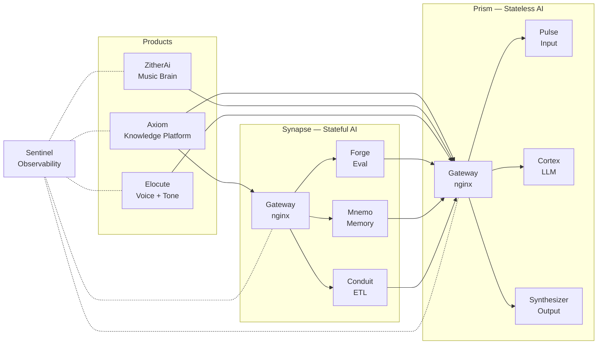
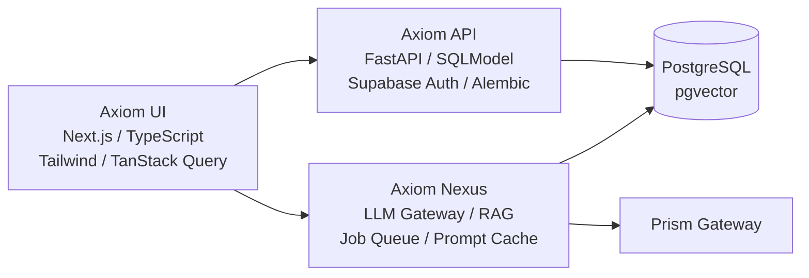
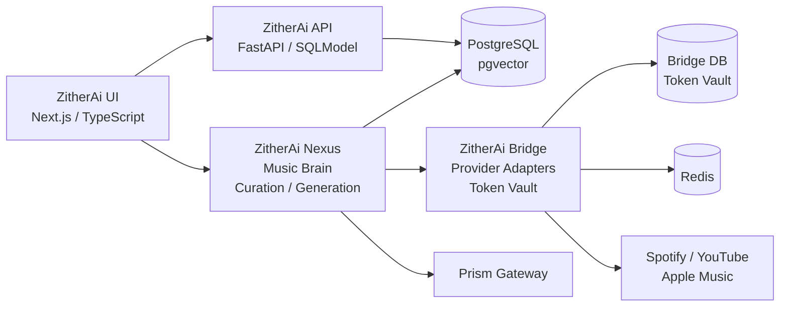
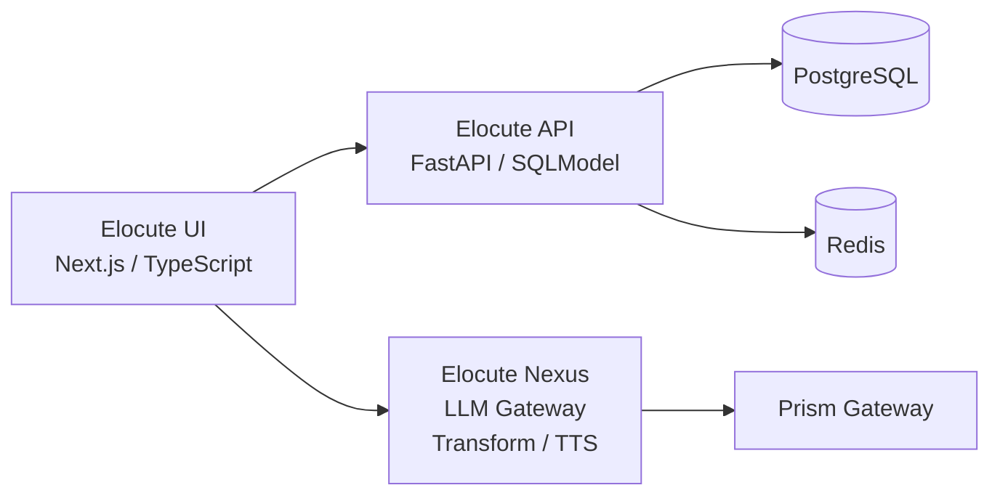
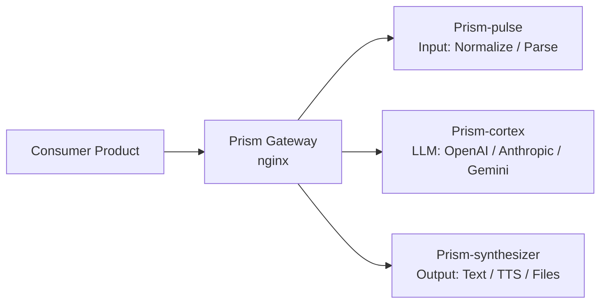
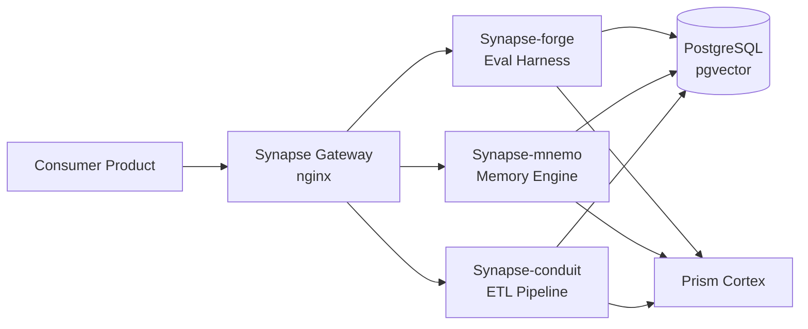
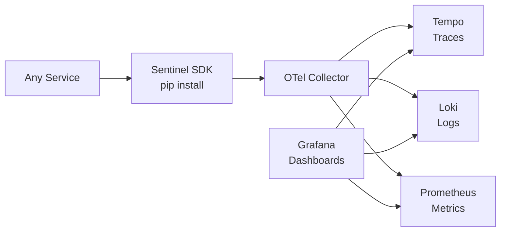

# Hey, I'm Vaibhav

Senior Software Engineer at Workday. I design and build production-grade distributed systems, AI-powered products, and developer infrastructure — then open-source the interesting parts.

---

### What I Build

**[Axiom](https://github.com/vsinghal3737?tab=repositories&q=axiom)** — AI-powered markdown knowledge platform. Streaming LLM workflows, semantic graph, RAG, rich editor, Graph View, Canvas, Tables, Review Inbox, Knowledge Q&A, Smart Paste, Weekly Reports, Daily Sparks. Production-hardened with RFC 9457 error responses, circuit breakers, RED metrics, and architecture contract tests.

**[ZitherAi](https://github.com/vsinghal3737?tab=repositories&q=zitherai)** — Music intelligence product. Taste modeling, 4-stage NL curation pipeline, playlist synthesis, 4-mode search (keyword, semantic, hum, clip), provider migration engine with 5-tier track matching, CRDT playlist sync, music generation via ElevenLabs, photo soundtrack pipeline, listening analytics, and adapters for Spotify, YouTube, and Apple Music. ~1,700 tests across 5 repos.

**[Elocute](https://github.com/vsinghal3737?tab=repositories&q=elocute)** — Voice-to-text and tone transformation product. Recording, transcription, smart text processing, tone system with streaming transform, TTS, export (PDF/DOCX/MD/SRT), templates, analytics, and a compose mode with context upload and SSE draft streaming.

**[Prism](https://github.com/vsinghal3737?tab=repositories&q=prism)** — Shared stateless AI microservices layer. Three services (Pulse, Cortex, Synthesizer) behind an nginx gateway. Multi-provider LLM support, circuit breakers, fallback chains, SSRF hardening, idempotency caching, and rate limiting. 687 tests.

**[Synapse](https://github.com/vsinghal3737?tab=repositories&q=synapse)** — Shared stateful AI platform. LLM-as-Judge eval harness (Forge), hierarchical memory engine with forgetting curves (Mnemo), and exactly-once ETL pipeline (Conduit). Schema-per-service on shared PostgreSQL with project-level tenant isolation.

**[Sentinel](https://github.com/vsinghal3737?tab=repositories&q=sentinel)** — Shared observability stack. OTel Collector, Tempo, Loki, Prometheus, and Grafana — plus a pip-installable SDK with a single `instrument(app)` entry point that wires traces, structured logs, metrics, and health checks. 143 tests.

---

### Tech Stack

---

### Architecture

Five products share two platform layers: **Prism** (stateless AI) and **Synapse** (stateful AI). **Sentinel** provides observability across the entire stack.

```mermaid
flowchart LR
    subgraph Products
        Axiom["Axiom<br/>Knowledge Platform"]
        ZitherAi["ZitherAi<br/>Music Brain"]
        Elocute["Elocute<br/>Voice + Tone"]
    end

    subgraph Prism["Prism — Stateless AI"]
        PGW["Gateway<br/>nginx"]
        P["Pulse<br/>Input"]
        C["Cortex<br/>LLM"]
        S["Synthesizer<br/>Output"]
    end

    subgraph Synapse["Synapse — Stateful AI"]
        SGW["Gateway<br/>nginx"]
        F["Forge<br/>Eval"]
        M["Mnemo<br/>Memory"]
        D["Conduit<br/>ETL"]
    end

    Sentinel["Sentinel<br/>Observability"]

    Axiom --> PGW
    Axiom --> SGW
    ZitherAi --> PGW
    Elocute --> PGW
    F --> PGW
    M --> PGW
    D --> PGW

    PGW --> P
    PGW --> C
    PGW --> S
    SGW --> F
    SGW --> M
    SGW --> D

    Sentinel -.- Axiom
    Sentinel -.- ZitherAi
    Sentinel -.- Elocute
    Sentinel -.- PGW
    Sentinel -.- SGW
```

<strong>Axiom — detailed architecture</strong>

 

Full-stack markdown notes platform with domain-driven FastAPI backend, Next.js editor, streaming and queued AI workflows, Docker orchestration, and architecture contract tests.

```mermaid
flowchart LR
    UI["Axiom UI<br/>Next.js / TypeScript<br/>Tailwind / TanStack Query"]
    API["Axiom API<br/>FastAPI / SQLModel<br/>Supabase Auth / Alembic"]
    Nexus["Axiom Nexus<br/>LLM Gateway / RAG<br/>Job Queue / Prompt Cache"]
    PG[("PostgreSQL<br/>pgvector")]
    Gateway["Prism Gateway"]

    UI --> API
    UI --> Nexus
    Nexus --> Gateway
    API --> PG
    Nexus --> PG
```

| Repo | Stack | What it does |
|------|-------|-------------|
| [`Axiom-api`](https://github.com/vsinghal3737/Axiom-api) | FastAPI / SQLModel / PostgreSQL | Backend API: notes, workspaces, graph/canvas/review, semantic search, AI proxies |
| [`Axiom-ui`](https://github.com/vsinghal3737/Axiom-ui) | Next.js / TypeScript / Tailwind | Frontend: BlockNote editor, graph/canvas/table surfaces, Review Inbox, AI reasoning UI |
| [`Axiom-nexus`](https://github.com/vsinghal3737/Axiom-nexus) | FastAPI / SSE / pgvector | AI gateway: jobs, RAG, embeddings, prompt cache, reasoning, similarity |
| [`Axiom-orchestration`](https://github.com/vsinghal3737/Axiom-orchestration) | Docker Compose / nginx / Make | Local stack, gateway routing, e2e testing, Prism network wiring |

<strong>ZitherAi — detailed architecture</strong>

 

AI music brain and playlist copilot with provider adapters, taste modeling, 4-stage NL curation, migration engine, CRDT sync, music generation, audio search, listening analytics, and library hygiene workflows.

```mermaid
flowchart LR
    ZUI["ZitherAi UI<br/>Next.js / TypeScript"]
    ZAPI["ZitherAi API<br/>FastAPI / SQLModel"]
    ZNexus["ZitherAi Nexus<br/>Music Brain<br/>Curation / Generation"]
    ZBridge["ZitherAi Bridge<br/>Provider Adapters<br/>Token Vault"]
    PG[("PostgreSQL<br/>pgvector")]
    BridgeDB[("Bridge DB<br/>Token Vault")]
    Redis[("Redis")]
    Providers["Spotify / YouTube<br/>Apple Music"]
    Gateway["Prism Gateway"]

    ZUI --> ZAPI
    ZUI --> ZNexus
    ZAPI --> PG
    ZNexus --> PG
    ZNexus --> ZBridge
    ZNexus --> Gateway
    ZBridge --> BridgeDB
    ZBridge --> Redis
    ZBridge --> Providers
```

| Repo | Stack | What it does |
|------|-------|-------------|
| [`ZitherAi-api`](https://github.com/vsinghal3737/ZitherAi-api) | FastAPI / SQLModel / PostgreSQL | Backend API: users, providers, taste profiles, playlists, library, listening history, HMAC auth |
| [`ZitherAi-ui`](https://github.com/vsinghal3737/ZitherAi-ui) | Next.js / TypeScript / Tailwind | Frontend: chat-first discovery, curation compose, migration tape deck, generation studio, audio search, force-graph library, cinema player |
| [`ZitherAi-nexus`](https://github.com/vsinghal3737/ZitherAi-nexus) | FastAPI / SSE / pgvector | Music brain: 8-step recommendation, 4-stage curation, CRDT sync, generation jobs, semantic + audio search, taste clustering, cost ledger |
| [`ZitherAi-bridge`](https://github.com/vsinghal3737/ZitherAi-bridge) | FastAPI / PostgreSQL / Redis | Provider adapters: Spotify, YouTube, Apple Music. AES-256-GCM token vault, rate limiting, circuit breakers |
| [`ZitherAi-orchestration`](https://github.com/vsinghal3737/ZitherAi-orchestration) | Docker Compose / nginx / Make | Local stack, gateway routing, Prism network wiring, e2e checks |

<strong>Elocute — detailed architecture</strong>

 

Voice-to-text and tone transformation product. Recording, transcription, smart text processing, streaming tone transform, TTS, multi-format export, templates, analytics, and a compose mode with context upload.

```mermaid
flowchart LR
    EUI["Elocute UI<br/>Next.js / TypeScript"]
    EAPI["Elocute API<br/>FastAPI / SQLModel"]
    ENexus["Elocute Nexus<br/>LLM Gateway<br/>Transform / TTS"]
    PG[("PostgreSQL")]
    Redis[("Redis")]
    Gateway["Prism Gateway"]

    EUI --> EAPI
    EUI --> ENexus
    EAPI --> PG
    EAPI --> Redis
    ENexus --> Gateway
```

| Repo | Stack | What it does |
|------|-------|-------------|
| [`Elocute-api`](https://github.com/vsinghal3737/Elocute-api) | FastAPI / SQLModel / PostgreSQL | Backend API: sessions, history, dictionary, snippets, templates, analytics |
| [`Elocute-nexus`](https://github.com/vsinghal3737/Elocute-nexus) | FastAPI / SSE / Redis | LLM gateway: transcription, tone transform, TTS, compose draft streaming |
| [`Elocute-ui`](https://github.com/vsinghal3737/Elocute-ui) | Next.js / TypeScript / Tailwind | Frontend: recorder, tone controls, export, template builder, analytics dashboard |
| [`Elocute-orchestration`](https://github.com/vsinghal3737/Elocute-orchestration) | Docker Compose / nginx / Make | Local stack, gateway routing, Prism network wiring |

<strong>Prism — detailed architecture</strong>

 

Reusable stateless AI microservices layer. Three services behind an nginx gateway with stable routes (`/pulse/v1`, `/cortex/v1`, `/synthesizer/v1`). 687 tests across 4 repos.

```mermaid
flowchart LR
    Client["Consumer Product"]
    Gateway["Prism Gateway<br/>nginx"]
    Pulse["Prism-pulse<br/>Input: Normalize / Parse"]
    Cortex["Prism-cortex<br/>LLM: OpenAI / Anthropic / Gemini"]
    Synthesizer["Prism-synthesizer<br/>Output: Text / TTS / Files"]

    Client --> Gateway
    Gateway --> Pulse
    Gateway --> Cortex
    Gateway --> Synthesizer
```

| Repo | Stack | What it does |
|------|-------|-------------|
| [`Prism-pulse`](https://github.com/vsinghal3737/Prism-pulse) | FastAPI / stateless | Input service: text normalization, document parsing, audio preparation, SSRF hardening |
| [`Prism-cortex`](https://github.com/vsinghal3737/Prism-cortex) | FastAPI / stateless | LLM executor: multi-provider streaming, circuit breakers, fallback chains, idempotency cache |
| [`Prism-synthesizer`](https://github.com/vsinghal3737/Prism-synthesizer) | FastAPI / stateless | Output service: text rendering, TTS, file generation, rate limiting |
| [`Prism-orchestration`](https://github.com/vsinghal3737/Prism-orchestration) | Docker Compose / nginx / Make | Gateway routing, dev/e2e env, external `prism-network` |

<strong>Synapse — detailed architecture</strong>

 

Shared stateful AI platform. Three services behind an nginx gateway. Schema-per-service on shared PostgreSQL with project-level tenant isolation. Calls Prism Cortex for all LLM work.

```mermaid
flowchart LR
    Client["Consumer Product"]
    Gateway["Synapse Gateway<br/>nginx"]
    Forge["Synapse-forge<br/>Eval Harness"]
    Mnemo["Synapse-mnemo<br/>Memory Engine"]
    Conduit["Synapse-conduit<br/>ETL Pipeline"]
    PG[("PostgreSQL<br/>pgvector")]
    Prism["Prism Cortex"]

    Client --> Gateway
    Gateway --> Forge & Mnemo & Conduit
    Forge --> PG
    Mnemo --> PG
    Conduit --> PG
    Forge --> Prism
    Mnemo --> Prism
    Conduit --> Prism
```

| Repo | Stack | What it does |
|------|-------|-------------|
| [`Synapse-forge`](https://github.com/vsinghal3737/Synapse-forge) | FastAPI / PostgreSQL | Eval harness: prompt versioning, assertion suites, LLM-as-Judge, regression detection |
| [`Synapse-mnemo`](https://github.com/vsinghal3737/Synapse-mnemo) | FastAPI / PostgreSQL / pgvector | Memory engine: fact extraction, hierarchical memory, forgetting curves, hybrid retrieval |
| [`Synapse-conduit`](https://github.com/vsinghal3737/Synapse-conduit) | FastAPI / PostgreSQL | ETL pipeline: LLM extraction, exactly-once delivery, backpressure, checkpointing |
| [`Synapse-orchestration`](https://github.com/vsinghal3737/Synapse-orchestration) | Docker Compose / nginx / Make | Gateway routing, shared DB, `synapse-network` |

<strong>Sentinel — detailed architecture</strong>

 

Shared observability stack consumed by all services. Five infrastructure containers plus a pip-installable SDK. Single `instrument(app, "service-name")` call wires traces, structured logs, metrics, and health endpoints.

```mermaid
flowchart LR
    App["Any Service"]
    SDK["Sentinel SDK<br/>pip install"]
    Collector["OTel Collector"]
    Tempo["Tempo<br/>Traces"]
    Loki["Loki<br/>Logs"]
    Prom["Prometheus<br/>Metrics"]
    Grafana["Grafana<br/>Dashboards"]

    App --> SDK
    SDK --> Collector
    Collector --> Tempo & Loki & Prom
    Grafana --> Tempo & Loki & Prom
```

| Repo | Stack | What it does |
|------|-------|-------------|
| [`Sentinel-sdk`](https://github.com/vsinghal3737/Sentinel-sdk) | Python / OTel / structlog | Pip-installable library: tracing, structured logging, metrics, health checks, secret redaction. 112 tests |
| [`Sentinel-orchestration`](https://github.com/vsinghal3737/Sentinel-orchestration) | Docker Compose / OTel Collector | Infrastructure: Collector, Tempo, Loki, Prometheus, Grafana, alert rules. 31 tests |

---

### Other Projects

- **SmartKart** — AI-powered meal-kit ordering with event-driven conversational ordering — [`SmartKart-api`](https://github.com/vsinghal3737/SmartKart-api)
- **Portfolio** — [vaibhavsinghal.dev](https://www.vaibhavsinghal.dev/) — [`repo`](https://github.com/vsinghal3737/Vaibhav-Singhal-Portfolio)
